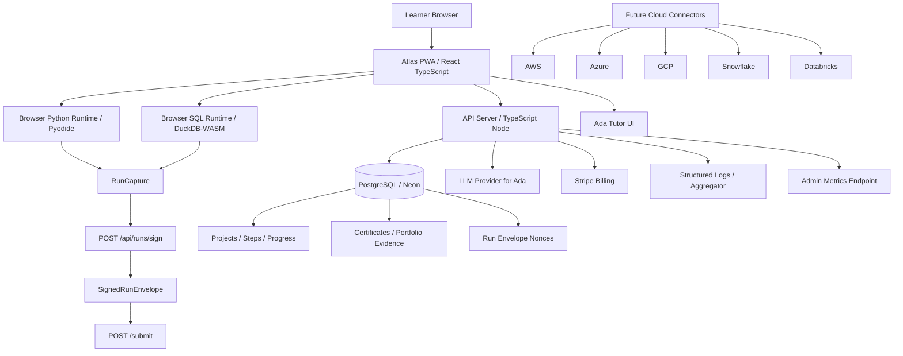

# ATLAS PLATFORM DEVELOPER BLUEPRINT

**Document purpose:** This is a single, self-contained developer blueprint for Atlas. It is written for a strong autonomous coding agent such as Claude Code / Opus-class agent that will either continue the existing repository or reconstruct the system from scratch if necessary.

**Product name:** Atlas  
**Product type:** Progressive Web App learning platform  
**Repository:** `https://github.com/findbene/Atlas`  
**Current known completion band:** approximately 35–55% complete as an engineered product; materially further along in architecture, curriculum governance, validation design, and safety discipline than in final commercial launch readiness.  
**Primary implementation language:** TypeScript  
**Core package manager:** pnpm  
**Core repo shape:** monorepo with `artifacts/`, `lib/`, `scripts/`, `docs/`, `HANDOFF.md`, and `replit.md`.

> **Important honesty note for the coding agent:** This blueprint combines verified public repository metadata, uploaded handoff/prompt context, and accumulated phase-level implementation history. Before editing the repository, clone the live repo and regenerate the exact current file inventory. Do not assume this document is a substitute for reading the current code. It is the implementation blueprint and operating specification.

---

# SECTION 1: PRODUCT VISION & GOALS

## 1.1 What Atlas is

Atlas is a project-first, hands-on technical learning platform for eight disciplines:

1. Data Engineering
2. AI Engineering
3. MLOps Engineering
4. Analytics Engineering
5. Cloud Data Engineering
6. Applied LLM Engineering
7. Python Mastery
8. SQL Mastery

Atlas teaches by having learners build complete, realistic, portfolio-grade projects rather than passively consuming lectures. Each project should have a realistic business/engineering scenario, concrete inputs, concrete outputs, a clear completion standard, validation metadata, hints, Ada tutor support, and a portfolio deliverable.

## 1.2 North star

The long-term north star is:

> Learners complete recruiter-relevant, verified project work that can be shown as credible portfolio evidence without Atlas overclaiming independent authorship or anti-cheat certainty.

Atlas is not merely a course viewer. It is a full learning-to-evidence platform.

## 1.3 Target learner personas

| Persona | Background | Goal | Atlas value |
|---|---|---|---|
| Career switcher | Basic Python/SQL, some cloud exposure | Build job-ready project portfolio | Guided projects, role paths, Ada tutoring |
| Junior data analyst | SQL + dashboards | Move into analytics engineering or data engineering | dbt, semantic layer, pipelines, tests |
| Aspiring AI engineer | Python + basic LLM usage | Learn production LLM systems | RAG, evals, structured outputs, guardrails |
| MLOps learner | ML course background | Learn deployment, monitoring, registry, CI/CD | MLOps project path |
| Cloud data learner | AWS/Azure/GCP fundamentals | Build real cloud-style data systems | Sandbox-first cloud labs, BYO cloud extension |
| SQL/Python mastery learner | Beginner/intermediate coder | Master fundamentals through projects | Python and SQL mastery tracks |

## 1.4 Competitive positioning

Atlas should differ from Coursera, Udemy, DataCamp, Codecademy, and bootcamps by combining:

- project-first curriculum
- role-path sequencing
- embedded IDEs
- AI tutor context awareness
- four learning modes
- validation-aware submissions
- evidence-backed completion records
- honest public verification
- cloud and data platform realism
- portfolio/GitHub/LinkedIn export
- admin-quality authoring factory
- strict H3 honesty boundary

## 1.5 Business model considerations

Potential monetization:

| Model | Description |
|---|---|
| Freemium | Free beginner projects, paid intermediate/advanced |
| Pro subscription | Ada tutor quota, certificates, portfolio export, cloud labs |
| Cohort/private beta | Guided cohort with feedback |
| Employer/team plans | Team dashboards, project paths, admin reports |
| Credential/capstone upsell | Premium verified capstones and reviews |

## 1.6 Atlas v1.0 success criteria

Atlas v1.0 is done when:

1. 100–150 visible projects are live and audited.
2. At least 20 flagship portfolio projects exist.
3. Core validation kinds are hardened or honestly classified.
4. Learners can complete projects end-to-end in the workspace.
5. Ada works contextually across modes.
6. Certificates and portfolio evidence are public/private as designed.
7. No H1/H2 overclaims exist in learner-facing copy.
8. Production deployment is stable.
9. Billing/auth/onboarding are functional.
10. Private beta learners can complete projects without internal intervention.

Longer-term public launch target: 300–400 premium projects, roughly 50 per major discipline/role path, including strong SQL and Python mastery plus cloud/data/AI integrations.

---

# SECTION 2: CURRENT STATE OF THE CODEBASE

## 2.1 Known top-level repository structure

The public repository is known to have this top-level shape:

```text
Atlas/
  artifacts/
  attached_assets/
  docs/
  lib/
  screenshots/
  scripts/
  .gitignore
  .npmrc
  .replit
  .replitignore
  HANDOFF.md
  package.json
  pnpm-lock.yaml
  pnpm-workspace.yaml
  replit.md
  tsconfig.base.json
  tsconfig.json
```

The repo is TypeScript-heavy and uses pnpm. The root `package.json` includes scripts for `build`, `typecheck`, `typecheck:libs`, and `check:no-heuristic-runtime`.

## 2.2 Known workspace areas

```text
artifacts/atlas/           # frontend learner/admin PWA
artifacts/api-server/      # backend API server
lib/db/                    # database schema/migrations/helpers
lib/execution-core/        # execution/validation/domain runtime helpers
lib/curriculum-quality/    # authoring and audit quality checks
lib/api-spec/              # OpenAPI contract
lib/api-client-react/      # generated frontend API client
lib/api-zod/               # generated Zod schemas
scripts/                   # seed, audit, migration, backfill, authoring scripts
docs/                      # phase docs, specs, runbooks
```

## 2.3 Current shipped state by subsystem

| Subsystem | Status | Notes |
|---|---|---|
| Project catalog | Functional | 60 visible publish-ready projects after Phase 55 visibility flip |
| Project authoring | Functional | AuthoredProject modules, audits, hidden promotion flow |
| Learning modes | Implemented v1 | Guided, Hint-Based, Independent, Adaptive |
| Ada tutor | Implemented foundation | Mode-aware contract exists; deeper memory/skill model incomplete |
| Python IDE | Functional foundation | Pyodide runtime and output capture exist |
| SQL editor | Functional foundation | DuckDB-WASM client feedback exists |
| `/check` | Functional but evidence policy needs finalization | Practice path; not fully parity-designed for signed evidence |
| `/submit` | Functional | Legacy and signed-envelope branch exist |
| Signed RunEnvelope | Implemented | Used for `json_equal` pilot path; not broadly flipped |
| `contains` hardening | Phase 56 shipped | Structured literal support added, no project opt-in yet |
| `csv_set_equal` hardening | Phase 57A + 57B-prereq shipped | Dark comparator and frontend shape wiring exist; no DB opt-in yet |
| `sql_resultset` hardening | Not yet done | Needs Phase 58 |
| Certificates/verify | Implemented | Copy hardened to avoid overclaims |
| Portfolio evidence | Implemented v1 | Needs export/artifact contract |
| Copy safety | Implemented strong guard | Unicode-normalized H1/H2 banned phrase guard |
| Production deploy | Not executed by agent | Deployment checklist exists |
| Phase 52 canary | Operator kit prepared | Flip not executed |

## 2.4 Current project catalog state

Latest known state:

- 60 visible publish-ready projects.
- C1 and C2 from Phase 55 are now visible.
- `audit:authoring` visible publish-ready: 60/60.
- `audit:pedagogy`: green.
- C1 and C2 remain `qualityStatus=unreviewed`, which is normal for the existing workflow.
- Phase 52 signed-envelope canary remains operator-pending.

## 2.5 Current validation state

| Kind | Current status |
|---|---|
| `exact` | Strong server-side string comparison |
| `contains` | Phase 56 structured support exists; legacy steps unchanged unless opted in |
| `json_equal` | Signed-envelope pilot infrastructure exists; production canary not executed |
| `csv_set_equal` | Dark server comparator exists; frontend submission shape wiring exists; no live opt-in |
| `sql_resultset` | Client DuckDB-WASM feedback exists; server commit path still needs hardening |
| `numeric_tolerance` | Often contract-shaped; needs future hardening |
| `self_attest` | User-attested path; not proof of technical execution |

## 2.6 Known active/incomplete work

The most recent incomplete planned work is:

1. Phase 57C / csv_set_equal trust decision and first opt-in plan.
2. Phase 58 / sql_resultset hardening.
3. Phase 59 / `/check` vs `/submit` evidence policy.
4. Phase 60 / GitHub and portfolio artifact contract.
5. Phase 61 / authoring factory v2.
6. Phase 62 / cloud lab safety architecture.
7. Phase 52 operator canary execution remains pending.

---

# SECTION 3: ARCHITECTURE & SYSTEM DESIGN

## 3.1 Overall architecture



## 3.2 Frontend architecture

Recommended/current-aligned stack:

```text
React
TypeScript
Vite or equivalent
Vitest
React Testing Library
Generated React API client
Pyodide
DuckDB-WASM
Code editor: Monaco or CodeMirror-compatible abstraction
```

Core pages:

| Route | Page | Auth | Purpose |
|---|---|---|---|
| `/` | Home | Public | Product introduction, role paths, CTA |
| `/courses` | Courses | Public/auth | Browse disciplines |
| `/courses/:slug` | Course detail | Public/auth | Show projects in role path |
| `/projects/:slug` | Project detail/workspace entry | Auth recommended | Project overview/enroll |
| `/workspace/:slug` or equivalent | Project workspace | Auth | IDE, steps, Ada, validation |
| `/profile` | Profile | Auth | Progress and portfolio |
| `/certificates` | Certificates | Auth | Completion records |
| `/verify/:certId` | Public verify | Public | Public completion record |
| `/how-atlas-grades` | Grading disclosure | Public | Trust boundary and validation explanation |
| `/admin/*` | Admin | Admin | Quality, metrics, review |

Major frontend components:

```text
StudioShell
ModeSelector
InstructionsPanel
HintLadder
AdaTutorPanel
CodeEditor
SqlEditor
RunOutputPanel
ValidationFeedbackPanel
RemediationPanel
CompletionPanel
ProjectStepNavigator
```

## 3.3 Backend architecture

Recommended/current-aligned stack:

```text
Node.js
TypeScript
Express-style routes
Drizzle ORM
PostgreSQL
Zod-style validation
OpenAPI
Vitest
Structured logging
```

Core route modules:

```text
artifacts/api-server/src/routes/user.ts
artifacts/api-server/src/routes/runs.ts
artifacts/api-server/src/routes/admin.ts
artifacts/api-server/src/routes/enrollment.ts
artifacts/api-server/src/routes/projects.ts
artifacts/api-server/src/routes/verify.ts
artifacts/api-server/src/routes/payments.ts
artifacts/api-server/src/routes/tutor.ts
```

Important endpoints:

| Method | Path | Auth | Purpose |
|---|---|---|---|
| GET | `/api/projects` | optional/auth | List visible projects |
| GET | `/api/projects/:slug` | optional/auth | Project detail and steps |
| POST | `/api/enrollments` | auth | Enroll in project |
| POST | `/api/user/projects/:projectId/steps/:stepId/check` | auth | Practice validation |
| POST | `/api/user/projects/:projectId/steps/:stepId/submit` | auth | Durable submission/progress |
| POST | `/api/runs/sign` | auth | Sign runtime capture |
| GET | `/api/verify/:certId` | public | Public completion record |
| GET | `/api/admin/envelope/metrics` | admin | Envelope metrics snapshot |
| POST | `/api/tutor/message` | auth | Ada tutor interaction |

## 3.4 Database architecture

Database target:

```text
PostgreSQL / Neon
Drizzle ORM
Explicit migrations
No boot-time migration
```

Core tables:

```text
users
projects
project_steps
project_candidates
user_progress
step_attempts / user_step_completions
xp_transactions
certificates
portfolio_evidence
run_envelope_nonces
tutor_messages
tutor_events
payments / subscriptions
```

## 3.5 AI layer architecture — Ada

Ada is a mode-aware, project-aware tutor.

Flow:

```text
AdaTutorPanel
→ POST /api/tutor/message
→ auth/rate limit
→ load current project/step/progress/mode
→ assemble Ada system + context prompt
→ call LLM provider
→ apply leakage/safety checks
→ log tutor event
→ return response
```

Ada receives:

```text
discipline
project title
project scenario
current step
learning mode
current code/query
latest runtime error
latest validation result
hint level used
attempt count
```

Ada must not receive:

```text
cloud secrets
Stripe/payment secrets
raw hidden answer keys unless strictly needed and policy-safe
private user data unrelated to learning
```

## 3.6 IDE architecture

### Python IDE

Runtime:

```text
Pyodide browser runtime
stdout/stderr capture
durationMs
exitCode
RunCapture
signed envelope optional
```

Features:

```text
code editor
run/check/submit
stdout/stderr
file tree future
test panel future
package availability warning
stale capture invalidation
```

### SQL Editor

Runtime:

```text
DuckDB-WASM
fixture/seed loading
SQL execution
result table
row-set comparison
captured columns/rows
```

Current key improvement already shipped:

- `csv_set_equal` future opt-ins can submit captured `{columns, rows}` JSON when `serverGrade:true`.
- No current rows are opted in.

## 3.7 Cloud platform integration architecture

Cloud integrations are planned, not fully implemented.

Atlas should use a two-mode design:

1. Sandbox Mode
2. BYO Cloud Mode

### Sandbox Mode

Runs without real credentials:

```text
DuckDB
Pyodide
mock S3/GCS/Blob
mock IAM
local dbt
mock Kafka/EventBridge/PubSub
fixture data
deterministic mock LLM
```

### BYO Cloud Mode

Optional advanced path:

```text
learner connects AWS/Azure/GCP/Snowflake/Databricks account
Atlas provides least-privilege templates
Atlas validates connection
Atlas guides lab execution
Atlas provides cleanup and cost warnings
```

Do not implement real cloud credential flows until the credential security model is finalized.

---

# SECTION 4: DATA MODELS & SCHEMAS

## 4.1 Users

```sql
CREATE TABLE users (
  id UUID PRIMARY KEY,
  clerk_id TEXT UNIQUE,
  email TEXT,
  display_name TEXT,
  role_goal TEXT,
  created_at TIMESTAMP NOT NULL DEFAULT now(),
  updated_at TIMESTAMP NOT NULL DEFAULT now()
);
```

## 4.2 Projects

```sql
CREATE TABLE projects (
  id UUID PRIMARY KEY,
  slug TEXT UNIQUE NOT NULL,
  title TEXT NOT NULL,
  course TEXT NOT NULL,
  role_path TEXT NOT NULL,
  domain TEXT,
  difficulty TEXT NOT NULL CHECK (difficulty IN ('beginner', 'intermediate', 'advanced')),
  description TEXT NOT NULL,
  scenario TEXT,
  estimated_minutes INTEGER,
  xp INTEGER,
  learner_visible BOOLEAN NOT NULL DEFAULT false,
  quality_status TEXT NOT NULL DEFAULT 'unreviewed',
  source_candidate_id UUID,
  enrolled_count INTEGER NOT NULL DEFAULT 0,
  created_at TIMESTAMP NOT NULL DEFAULT now(),
  updated_at TIMESTAMP NOT NULL DEFAULT now()
);
```

## 4.3 Project steps

```sql
CREATE TABLE project_steps (
  id UUID PRIMARY KEY,
  project_id UUID NOT NULL REFERENCES projects(id) ON DELETE CASCADE,
  step_number INTEGER NOT NULL,
  title TEXT NOT NULL,
  instruction_md TEXT NOT NULL,
  step_type TEXT NOT NULL,
  validation_type TEXT NOT NULL,
  validation_config JSONB,
  expected_output JSONB,
  hints JSONB NOT NULL DEFAULT '[]',
  success_feedback TEXT,
  failure_feedback TEXT,
  portfolio_relevance TEXT,
  final_explanation TEXT,
  misconception_to_watch_for TEXT,
  created_at TIMESTAMP NOT NULL DEFAULT now(),
  updated_at TIMESTAMP NOT NULL DEFAULT now(),
  UNIQUE(project_id, step_number)
);
```

## 4.4 Project candidates

```sql
CREATE TABLE project_candidates (
  id UUID PRIMARY KEY,
  slug TEXT UNIQUE NOT NULL,
  source TEXT NOT NULL,
  status TEXT NOT NULL DEFAULT 'draft',
  reviewer_notes TEXT,
  authored_payload JSONB,
  promoted_project_id UUID,
  created_at TIMESTAMP NOT NULL DEFAULT now(),
  updated_at TIMESTAMP NOT NULL DEFAULT now()
);
```

## 4.5 User progress

```sql
CREATE TABLE user_progress (
  id UUID PRIMARY KEY,
  user_id UUID NOT NULL REFERENCES users(id),
  project_id UUID NOT NULL REFERENCES projects(id),
  status TEXT NOT NULL DEFAULT 'started',
  current_step_id UUID,
  selected_learning_mode TEXT NOT NULL DEFAULT 'guided',
  started_at TIMESTAMP NOT NULL DEFAULT now(),
  completed_at TIMESTAMP,
  xp_earned INTEGER NOT NULL DEFAULT 0,
  created_at TIMESTAMP NOT NULL DEFAULT now(),
  updated_at TIMESTAMP NOT NULL DEFAULT now(),
  UNIQUE(user_id, project_id)
);
```

## 4.6 Step attempts / completions

```sql
CREATE TABLE step_attempts (
  id UUID PRIMARY KEY,
  user_id UUID NOT NULL REFERENCES users(id),
  project_id UUID NOT NULL REFERENCES projects(id),
  step_id UUID NOT NULL REFERENCES project_steps(id),
  attempt_type TEXT NOT NULL CHECK (attempt_type IN ('check', 'submit')),
  validation_type TEXT NOT NULL,
  submission_sha256 TEXT,
  passed BOOLEAN NOT NULL,
  feedback TEXT,
  envelope_used BOOLEAN NOT NULL DEFAULT false,
  runtime_duration_ms INTEGER,
  created_at TIMESTAMP NOT NULL DEFAULT now()
);
```

## 4.7 XP transactions

```sql
CREATE TABLE xp_transactions (
  id UUID PRIMARY KEY,
  user_id UUID NOT NULL REFERENCES users(id),
  project_id UUID REFERENCES projects(id),
  step_id UUID REFERENCES project_steps(id),
  amount INTEGER NOT NULL,
  reason TEXT NOT NULL,
  created_at TIMESTAMP NOT NULL DEFAULT now()
);
```

## 4.8 Certificates

```sql
CREATE TABLE certificates (
  id UUID PRIMARY KEY,
  public_cert_id TEXT UNIQUE NOT NULL,
  user_id UUID NOT NULL REFERENCES users(id),
  project_id UUID NOT NULL REFERENCES projects(id),
  issued_at TIMESTAMP NOT NULL DEFAULT now(),
  evidence_summary JSONB NOT NULL,
  public_verify_enabled BOOLEAN NOT NULL DEFAULT true
);
```

## 4.9 Portfolio evidence

```sql
CREATE TABLE portfolio_evidence (
  id UUID PRIMARY KEY,
  user_id UUID NOT NULL REFERENCES users(id),
  project_id UUID NOT NULL REFERENCES projects(id),
  certificate_id UUID REFERENCES certificates(id),
  steps_completed INTEGER NOT NULL,
  total_steps INTEGER NOT NULL,
  total_xp INTEGER NOT NULL,
  evidence_hash_count INTEGER NOT NULL,
  first_step_completed_at TIMESTAMP,
  completed_at TIMESTAMP,
  duration_seconds INTEGER,
  created_at TIMESTAMP NOT NULL DEFAULT now()
);
```

## 4.10 Run envelope nonces

```sql
CREATE TABLE run_envelope_nonces (
  nonce TEXT PRIMARY KEY,
  user_id UUID NOT NULL,
  project_id UUID NOT NULL,
  step_id UUID NOT NULL,
  validation_kind TEXT NOT NULL,
  expires_at TIMESTAMP NOT NULL,
  used_at TIMESTAMP NOT NULL DEFAULT now(),
  created_at TIMESTAMP NOT NULL DEFAULT now()
);
```

## 4.11 Ada tutor messages

```sql
CREATE TABLE tutor_messages (
  id UUID PRIMARY KEY,
  user_id UUID NOT NULL REFERENCES users(id),
  project_id UUID REFERENCES projects(id),
  step_id UUID REFERENCES project_steps(id),
  learning_mode TEXT,
  role TEXT NOT NULL CHECK (role IN ('user', 'assistant', 'system')),
  content TEXT NOT NULL,
  created_at TIMESTAMP NOT NULL DEFAULT now()
);
```

## 4.12 Cloud connections — future

```sql
CREATE TABLE cloud_connections (
  id UUID PRIMARY KEY,
  user_id UUID NOT NULL REFERENCES users(id),
  provider TEXT NOT NULL CHECK (provider IN ('aws', 'azure', 'gcp', 'snowflake', 'databricks')),
  display_name TEXT NOT NULL,
  encrypted_secret_ref TEXT NOT NULL,
  scopes JSONB NOT NULL DEFAULT '{}',
  status TEXT NOT NULL DEFAULT 'pending',
  last_validated_at TIMESTAMP,
  created_at TIMESTAMP NOT NULL DEFAULT now(),
  updated_at TIMESTAMP NOT NULL DEFAULT now()
);
```

---

# SECTION 5: SEED DATA & CONTENT SPECS

## 5.1 Disciplines

```json
[
  { "slug": "data-engineering", "title": "Data Engineering" },
  { "slug": "ai-engineering", "title": "AI Engineering" },
  { "slug": "mlops-engineering", "title": "MLOps Engineering" },
  { "slug": "analytics-engineering", "title": "Analytics Engineering" },
  { "slug": "cloud-data-engineering", "title": "Cloud Data Engineering" },
  { "slug": "applied-llm-engineering", "title": "Applied LLM Engineering" },
  { "slug": "python-mastery", "title": "Python Mastery" },
  { "slug": "sql-mastery", "title": "SQL Mastery" }
]
```

## 5.2 Target scale

Launch ambition:

```text
50 projects per discipline minimum
8 disciplines
300–400 premium projects for serious launch
long-term: 960–1000 total projects
```

## 5.3 Project tiers

| Tier | Typical steps | Typical minutes | Purpose |
|---|---:|---:|---|
| Beginner | 4–6 | 60–150 | Teach fundamentals |
| Intermediate | 6–8 | 180–360 | Portfolio-grade implementation |
| Advanced | 8–12 | 360–720 | Capstone/recruiter-grade work |

## 5.4 Required project fields

```ts
type AuthoredProject = {
  slug: string;
  title: string;
  course: string;
  rolePath: string;
  domain: string;
  difficulty: "beginner" | "intermediate" | "advanced";
  estimatedMinutes: number;
  xp: number;
  description: string;
  scenario: string;
  portfolioDeliverable: string;
  prerequisites: string[];
  skills: string[];
  tools: string[];
  steps: AuthoredStep[];
};
```

## 5.5 Required step fields

```ts
type AuthoredStep = {
  id: string;
  title: string;
  stepType: "code_python" | "code_sql" | "multi_file" | "markdown" | "self_attest";
  instructionMd: string;
  validationType: string;
  validationConfig: Record<string, unknown>;
  expectedOutput?: unknown;
  hints: string[];
  successFeedback: string;
  failureFeedback: string;
  portfolioRelevance: string;
  finalExplanation: string;
  misconceptionToWatchFor: string;
};
```

## 5.6 Example projects per discipline

### Data Engineering

Beginner: CSV Cleanup Pipeline  
Intermediate: REST API ELT with Staging and Marts  
Advanced: CDC Debezium Event Pipeline

### AI Engineering

Beginner: Prompt Classification with JSON Schema  
Intermediate: LLM Output Quality Scoring  
Advanced: RAG Baseline with pgvector and Evaluation

### MLOps Engineering

Beginner: Model Metrics Logging  
Intermediate: Feature Store with Point-in-Time Joins  
Advanced: Model Monitoring and Drift Detection

### Analytics Engineering

Beginner: Spreadsheet to SQL Models  
Intermediate: Semantic Layer with dbt + DuckDB  
Advanced: Snowflake Stream and Task Pipeline

### Cloud Data Engineering

Beginner: DuckDB Local Warehouse  
Intermediate: AWS S3 + Glue + Athena Lakehouse Simulation  
Advanced: Databricks Delta Lake Medallion Architecture

### Applied LLM Engineering

Beginner: Structured Prompting with JSON Schema  
Intermediate: LLM Guardrails and Structured Output Safety  
Advanced: Agent Tool-Calling with Audit Logs

### Python Mastery

Beginner: Functions and Files Project  
Intermediate: Pydantic Config and CLI  
Advanced: Async ETL and Testing Harness

### SQL Mastery

Beginner: SELECT / WHERE / JOIN Essentials  
Intermediate: CTE and Window Function Project  
Advanced: Query Optimization and Analytics Mart

---

# SECTION 6: FRONTEND — PAGES, COMPONENTS & UX FLOWS

## 6.1 Onboarding flow

```text
Sign up
→ choose role goal
→ choose experience level
→ optional diagnostic
→ recommended first project
→ choose learning mode
→ enter workspace
```

## 6.2 Project start flow

```text
Project detail
→ enroll
→ choose Guided / Hint-Based / Independent / Adaptive
→ open workspace
→ read scenario
→ start step 1
```

## 6.3 Learning mode behavior

| Mode | UX behavior |
|---|---|
| Guided | Step walkthrough, more Ada help, more explicit remediation |
| Hint-Based | Task prompt plus progressive hints |
| Independent | Minimal hints, no solution leakage, compact feedback |
| Adaptive | System recommends assistance level based on learner behavior |

## 6.4 Python IDE flow

```text
Open Python step
→ edit code
→ Run
→ Pyodide executes
→ show stdout/stderr
→ sign RunCapture when eligible
→ Check or Submit
```

## 6.5 SQL editor flow

```text
Open SQL step
→ edit query
→ Run
→ DuckDB-WASM executes
→ render result table
→ capture columns/rows
→ Check or Submit
```

## 6.6 Completion flow

```text
Final step passed
→ project completion recorded
→ XP awarded
→ certificate/evidence generated
→ portfolio card updated
→ share/export options shown
```

---

# SECTION 7: FEATURES SHIPPED SO FAR

| Feature | Status |
|---|---|
| Project catalog | Shipped |
| Role paths | Shipped v1 |
| Project workspace | Shipped v1 |
| Learning modes | Shipped v1 |
| Ada tutor contract | Shipped foundation |
| Pyodide runner | Shipped foundation |
| DuckDB-WASM feedback | Shipped foundation |
| Signed RunEnvelope library | Shipped |
| `/api/runs/sign` | Shipped |
| `/submit` envelope branch | Shipped |
| `json_equal` pilot grader | Shipped but not production flipped |
| `contains` structured hardening | Shipped dark capability |
| `csv_set_equal` dark comparator | Shipped |
| `csv_set_equal` frontend shape wiring | Shipped |
| `sql_resultset` hardening | Not shipped |
| Public verify page | Shipped |
| Portfolio evidence | Shipped v1 |
| Copy-safety guard | Shipped |
| Phase 52 canary flip kit | Shipped docs only |
| Cloud integrations | Planned |
| GitHub/LinkedIn export | Planned |

---

# SECTION 8: WHAT WAS TRIED AND FAILED

## 8.1 Naive `json_equal` server parsing

Attempted direction: parse server submission as JSON.

Failure: existing `json_equal` steps submitted source code, not runtime JSON.

Resolution: signed runtime capture architecture.

## 8.2 Root barrel export of crypto logic

Risk: Node crypto could leak into frontend bundle.

Resolution: server-only run-envelope export path.

## 8.3 Stale enrolled_count reliance

Risk: archive safety used stale counters.

Resolution: query `user_progress`; add durable backfill/writer.

## 8.4 Phase 51 zero-metrics gate

Failure: pre-flip metrics need not be zero because clients can send envelopes before enforcement.

Resolution: corrected runbook logic.

## 8.5 Phase 54 copy guard bypasses

Failure: exact substring matching missed Unicode and format-control evasions.

Resolution: NFKC, `\p{Cf}` strip, Unicode boundaries.

## 8.6 C1 “server-enforced” wording

Failure: contained overstatement.

Resolution: “audit-classified enforced kind.”

## 8.7 C2 invalid `code_yaml` step type

Failure: unsupported step type.

Resolution: use `multi_file`.

## 8.8 Phase 56 empty `needles[]` string risk

Failure: runtime accepted empty-string entries that could always pass.

Resolution: runtime/authoring symmetry; reject empty entries.

## 8.9 Phase 57B attempted opt-in blocker

Failure: frontend submitted raw SQL while server comparator expected `{columns, rows}` JSON.

Resolution: Phase 57B-prereq added frontend submission-shape wiring; opt-in remains deferred.

---

# SECTION 9: WHAT IS CURRENTLY BEING ACTIVELY EDITED

No file should be considered intentionally unstable at the time of this blueprint.

Most recently touched systems:

```text
artifacts/api-server/src/lib/grading.ts
lib/curriculum-quality/src/authoring.ts
scripts/src/audit-contains-bc.ts
scripts/src/audit-csv-set-equal-bc.ts
artifacts/atlas/src/lib/csvSetEqualSubmit.ts
artifacts/atlas/src/pages/project-workspace.tsx
docs/phases/*
HANDOFF.md
replit.md
```

Current next active decision:

```text
Phase 57C: Decide signed-envelope vs raw JSON trust model for first csv_set_equal serverGrade opt-in.
```

---

# SECTION 10: WHAT TO BUILD NEXT — ORDERED PRIORITY LIST

## 10.1 Phase 57C — csv_set_equal trust decision and opt-in plan

Build/read:

```text
artifacts/api-server/src/lib/grading.ts
artifacts/api-server/src/lib/envelopeSubmit.ts
artifacts/api-server/src/lib/envelopeGrade.ts
artifacts/atlas/src/lib/csvSetEqualSubmit.ts
artifacts/atlas/src/pages/project-workspace.tsx
```

Done when:

- decision document compares raw JSON vs signed envelope
- first opt-in candidate is confirmed
- rollback plan exists
- Architect approves
- no DB row changed during proposal

## 10.2 Phase 57B-flip — first csv_set_equal opt-in

Done when:

- one C2 step opts into `serverGrade:true`
- passing/failing submissions tested
- rollback by removing `serverGrade:true`
- no broad catalog change

## 10.3 Phase 58 — sql_resultset hardening

Done when:

- client-provisional SQL steps have a hardened path
- canonical result format defined
- submission trust model decided
- BC gate exists

## 10.4 Phase 59 — /check vs /submit evidence policy

Done when:

- `/check` is practice-only
- `/submit` is evidence path
- nonce burn strategy defined
- UI copy explains difference

## 10.5 Phase 60 — GitHub/portfolio artifact contract

Done when every project has a standard deliverable shape:

```text
README
setup
run instructions
tests
sample output
skills practiced
portfolio summary
share-safe text
```

## 10.6 Phase 61 — authoring factory v2

Done when wave-based authoring can safely produce 6–10 hidden project candidates per wave.

## 10.7 Phase 62 — cloud lab safety architecture

Done when AWS/Azure/GCP/Snowflake/Databricks projects have a sandbox-first and BYO-cloud safety contract.

---

# SECTION 11: TOP 30 MOST CRUCIAL IMPROVEMENTS

| Rank | Item | Importance |
|---:|---|---|
| 1 | csv_set_equal signed/verified opt-in | High |
| 2 | sql_resultset hardening | High |
| 3 | /check vs /submit evidence policy | High |
| 4 | GitHub/portfolio artifact contract | High |
| 5 | project authoring factory v2 | High |
| 6 | cloud lab safety architecture | High |
| 7 | production deployment | High |
| 8 | Phase 52 canary execution | High |
| 9 | learner onboarding flow | High |
| 10 | skill model v1 | High |
| 11 | prerequisite graph | High |
| 12 | diagnostic assessment | High |
| 13 | admin project review queue | High |
| 14 | role-path readiness dashboard | High |
| 15 | GitHub export | High |
| 16 | LinkedIn sharing | High |
| 17 | AWS sandbox/BYO lane | High |
| 18 | Azure sandbox/BYO lane | High |
| 19 | GCP sandbox/BYO lane | High |
| 20 | Snowflake lane | High |
| 21 | Databricks lane | High |
| 22 | SQL mastery expansion | High |
| 23 | Python mastery expansion | High |
| 24 | capstone projects | High |
| 25 | private beta support loop | High |
| 26 | billing production readiness | Medium |
| 27 | Ada tutor memory | Medium |
| 28 | tutor cost controls | Medium |
| 29 | UI polish/design system | Medium |
| 30 | analytics/telemetry dashboard | Medium |

---

# SECTION 12: ENVIRONMENT, CONFIGURATION & SECRETS

## 12.1 Required env vars

```bash
DATABASE_URL=postgresql://...
CLERK_SECRET_KEY=...
JWT_SECRET=...
RUN_ENVELOPE_SIGNING_SECRET=...
ATLAS_ENVELOPE_REQUIRED_KINDS=
ATLAS_ENVELOPE_CANARY_KINDS=
ATLAS_ENVELOPE_CANARY_PERCENT=
STRIPE_SECRET_KEY=...
STRIPE_WEBHOOK_SECRET=...
LLM_PROVIDER_API_KEY=...
```

## 12.2 Local setup

```bash
git clone https://github.com/findbene/Atlas.git
cd Atlas
pnpm install
pnpm run typecheck
pnpm --filter @workspace/scripts run migrate
pnpm --filter @workspace/api-server run dev
pnpm --filter @workspace/atlas run dev
```

## 12.3 Quality commands

```bash
pnpm run typecheck
pnpm --filter @workspace/api-server run test
pnpm --filter @workspace/atlas run test
pnpm --filter @workspace/execution-core run test
pnpm --filter @workspace/curriculum-quality run test
pnpm --filter @workspace/scripts run audit:authoring
pnpm --filter @workspace/scripts run audit:pedagogy
pnpm --filter @workspace/scripts run audit:contains-bc
pnpm --filter @workspace/scripts run audit:csv-set-equal-bc
pnpm run check:no-heuristic-runtime
```

---

# SECTION 13: THIRD-PARTY INTEGRATIONS & DEPENDENCIES

Known/planned services:

| Service | Purpose | Status |
|---|---|---|
| Clerk/JWT auth | authentication | implemented/foundation |
| Stripe | billing | implemented/foundation |
| LLM provider | Ada tutor | implemented/foundation |
| Neon/PostgreSQL | database | planned production target |
| Pyodide | Python browser runtime | implemented/foundation |
| DuckDB-WASM | SQL browser runtime | implemented/foundation |
| AWS | future cloud labs | planned |
| Azure | future cloud labs | planned |
| GCP | future cloud labs | planned |
| Snowflake | future cloud labs | planned |
| Databricks | future cloud labs | planned |

---

# SECTION 14: TESTING STRATEGY & CURRENT TEST STATE

Current known gates:

```text
api-server: 459/459 after Phase 57A
curriculum-quality: 133/133 after Phase 57A
execution-core: 83/83
atlas: 155/155 after Phase 57B-prereq
audit:authoring: 60/60 visible publish-ready
audit:contains-bc: 29/29
audit:csv-set-equal-bc: 15/15
check:no-heuristic-runtime: OK
```

Testing strategy:

| Area | Required tests |
|---|---|
| Grading | unit tests + BC audits |
| Runtime capture | stale-race tests |
| API | auth, route behavior, failure modes |
| Frontend | helper tests + workspace behavior |
| Copy safety | banned phrase source/DOM scans |
| Authoring | schema and audit tests |
| Canaries | metrics and rollback verification |
| Cloud labs | sandboxed mock tests before real credentials |

---

# SECTION 15: INTERNAL DOCUMENTS FOR CLAUDE CODE

## 15.1 CLAUDE.md

```markdown
# CLAUDE.md — Atlas Agent Operating Guide

You are working on Atlas, a project-first PWA learning platform for Data Engineering, AI Engineering, MLOps Engineering, Analytics Engineering, Cloud Data Engineering, Applied LLM Engineering, Python Mastery, and SQL Mastery.

## Current priority
Finish core validation and platform hardening before high-speed project waves.

## Do not do
- Do not flip production canaries.
- Do not change env vars.
- Do not make schema/migration changes without explicit approval.
- Do not publish hidden projects without manual checklist.
- Do not overclaim validation/authorship.
- Do not touch Phase 52 operator kit unless asked.

## Commands
pnpm run typecheck
pnpm --filter @workspace/api-server run test
pnpm --filter @workspace/atlas run test
pnpm --filter @workspace/curriculum-quality run test
pnpm --filter @workspace/execution-core run test
pnpm --filter @workspace/scripts run audit:authoring
pnpm --filter @workspace/scripts run audit:pedagogy
pnpm --filter @workspace/scripts run audit:contains-bc
pnpm --filter @workspace/scripts run audit:csv-set-equal-bc
pnpm run check:no-heuristic-runtime

## H3 honesty boundary
Atlas may verify enabled runtime output matched expected result. Atlas must not claim independent authorship, cheat-proof validation, tamper-proof proof, or absence of outside help.
```

## 15.2 README.md

```markdown
# Atlas

Atlas is a project-first technical learning platform for modern data, AI, MLOps, analytics, cloud, Python, and SQL roles.

Learners build real projects, use browser-based Python and SQL runtimes, receive Ada AI tutor support, and earn evidence-backed completion records.

## Tech stack
- TypeScript monorepo
- React frontend
- Node/TypeScript API server
- PostgreSQL/Drizzle
- Pyodide
- DuckDB-WASM
- pnpm
- Vitest

## Setup
pnpm install
pnpm run typecheck
pnpm --filter @workspace/api-server run dev
pnpm --filter @workspace/atlas run dev

## Project status
Atlas is under active development. Core learning, validation, authoring, and evidence systems exist; production cloud integrations and full commercial launch remain in progress.
```

## 15.3 DESIGN.md

```markdown
# Atlas Design System

Atlas should feel serious, premium, technical, calm, and trustworthy.

## Principles
- clarity over decoration
- confidence without overclaiming
- code/workspace first
- accessible contrast
- strong progress feedback
- no gamification that undermines credibility

## Key UI areas
- role-path catalog
- project workspace
- Ada tutor panel
- IDE output panel
- validation feedback
- portfolio/certificate pages
```

## 15.4 PRD

```markdown
# Atlas PRD

## Objective
Build a project-first learning platform that helps learners gain job-relevant skills through validated, portfolio-grade technical projects.

## Core features
- role paths
- project catalog
- four learning modes
- Ada tutor
- Python IDE
- SQL editor
- validation/check/submit
- certificates
- portfolio
- admin review
- project authoring factory
- cloud lab architecture

## Success
Private beta learners can complete projects end-to-end, receive evidence-backed completion records, and export portfolio artifacts.
```

## 15.5 BRD

```markdown
# Atlas BRD

Atlas addresses the gap between passive learning and demonstrable job readiness. The business value is in producing visible, credible, recruiter-aligned technical project evidence.

## Target revenue paths
- subscriptions
- premium projects
- capstone reviews
- team plans
- employer partnerships
```

## 15.6 TRD

```markdown
# Atlas TRD

## Performance
- workspace interactions should feel immediate
- validation feedback under 1s where possible
- no unbounded browser execution

## Security
- no secret logging
- no cloud credentials in Ada prompts
- signed runtime evidence for enabled paths
- nonce replay prevention

## Reliability
- migrations explicit
- tests required before merge
- BC audits for grader changes
```

## 15.7 ARD

```markdown
# Atlas Architecture Requirements

## Decisions
- TypeScript monorepo
- React PWA
- Node/TypeScript API
- PostgreSQL/Drizzle
- browser runtimes for Python and SQL
- signed RunEnvelope for runtime evidence
- H3 honest claim boundary

## Tradeoffs
Browser execution improves cost/safety but requires signed evidence for stronger validation claims.
```

## 15.8 DRD

```markdown
# Atlas Design Requirements

Every page must be responsive, accessible, and trust-safe. Project workspace is the primary product surface. Ada must be visible but not distracting. Validation feedback must be clear, educational, and mode-aware.
```

---

# FINAL BUILD DIRECTIVE

Atlas must proceed in this order:

1. Finish validation hardening.
2. Finalize `/check` vs `/submit` evidence semantics.
3. Define portfolio/GitHub artifact contract.
4. Upgrade authoring factory.
5. Define cloud lab safety architecture.
6. Then accelerate into high-quality project waves.
7. Use hidden-first publishing and manual checklist gates.
8. Never sacrifice trust or validation integrity for speed.

The next exact technical decision is Phase 57C: choose the trust model for activating the first `csv_set_equal` serverGrade step.
